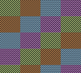
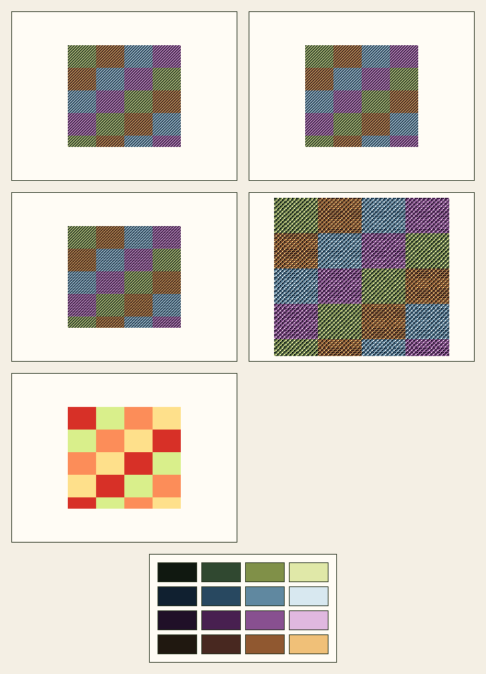

# pixgbc

`pixgbc` converts images into Game Boy Color-inspired pixel art.

Current implementation slice:

- Go module + package scaffold
- shared engine boundary
- `convert`, `inspect`, `palette list`, `serve`
- relaxed-mode MVP renderer
- strict `cgb-bg` tile/palette-bank renderer
- inspect recommendations for mode/palette fit
- composed debug-sheet export
- deterministic render golden-hash tests
- review bundle emission to temp/user-selected disk
- embedded local web UI with persisted review URLs/artifacts and basic render controls
- deterministic sample generator + checked-in example inputs/outputs
- benchmark coverage for render/palette hot paths
- CLI integration coverage for help/convert/inspect/palette/review flows
- tracked docs/example assets under `docs/assets/`

## Commands

```sh
go run ./cmd/pixgbc --help
go run ./cmd/pixgbc palette list
go run ./cmd/pixgbc inspect --input path/to/input.png --json
go run ./cmd/pixgbc convert --input path/to/input.png --output out.png
go run ./cmd/pixgbc convert --input path/to/input.png --output out.png --emit-review temp
go run ./cmd/pixgbc convert --input path/to/input.png --output out.png --mode cgb-bg --debug --emit-review temp
go run ./cmd/pixgbc convert samples/portrait-alpha.png -o out.png --alpha flatten --bg '#f4f1e8'
go run ./cmd/pixgbc serve --listen 127.0.0.1:8080 --artifact-ttl 24h --max-upload-bytes 10MB
make samples
make sample-outputs
make docs-assets
```

## Docker

Build:

```sh
docker build -t pixgbc:local .
```

Run the server:

```sh
docker run --rm -p 8080:8080 pixgbc:local
```

Run with a token:

```sh
docker run --rm -p 8080:8080 pixgbc:local serve --listen 0.0.0.0:8080 --token demo-token --artifact-ttl 24h --session-ttl 12h --render-rate-per-minute 60 --max-concurrent-renders 2 --max-upload-bytes 10MB
```

`convert --emit-review` writes `final.png`, `preview.png`, and `meta.json` into a review bundle directory and prints the bundle path.

`convert --mode cgb-bg` runs the stricter tile/palette-bank solver. Add `--debug` to persist a composed debug sheet into the review bundle.

`convert` also accepts `-o`, positional input, `--scale`, `--alpha`, `--bg`, `--brightness`, `--contrast`, `--gamma`, `--tile-size`, `--colors-per-tile`, and `--max-palettes`.

Checked-in sample inputs live in [samples/README.md](/Users/wesleykenyon/code/pixgbc/samples/README.md). `make sample-outputs` rebuilds the example PNG outputs and a strict-mode review bundle under `samples/`.

`inspect --json` now reports dominant colors, estimated strict-mode fit, and recommended mode/palette preset.

`serve` exposes browser controls for hosted sign-in, mode, preset vs extract, width/height, crop, dither, alpha mode, background color, brightness/contrast/gamma, preview scale, strict-mode tile params, and debug output.

In `cgb-bg`:

- `palette-mode preset` locks strict-mode banks back to the selected preset palette
- `palette-mode extract` uses direct sampled tile palettes from the image

If `serve` binds beyond localhost, `--token` is required. Browser sign-in now exchanges that token for an `HttpOnly` session cookie; direct/manual access still works via `?token=...` or `Authorization: Bearer ...` when needed.

Hosted hardening knobs:

- `--session-ttl 12h` controls browser session lifetime
- `--render-rate-per-minute 60` caps per-IP render volume; `0` disables
- `--max-concurrent-renders 2` caps in-flight renders; `0` disables

`serve` now sends basic hardening headers on all responses: CSP, `nosniff`, `DENY` framing, `no-referrer`, and locked-down permissions policy.

`serve --artifact-ttl` now does an initial expired-artifact sweep at startup and keeps cleaning old review bundles on an interval while the server runs.

`serve` now logs startup cleanup, cleanup sweeps, HTTP requests, and render start/done events to stdout for easier local monitoring.

`serve` also keeps a session render history in the browser UI so you can jump back to recent review pages, previews, finals, records, and debug sheets without rerendering.

`serve` persists browser renders into a temp review store and exposes:

- `GET /api/session`
- `POST /api/session/login`
- `POST /api/session/logout`
- `POST /api/render`
- `GET /api/renders/{id}`
- `GET /api/renders/{id}/artifacts/{name}`
- `GET /renders/{id}`

The review page now renders palettes, config, hashes, and strict-mode tile-bank distribution directly in HTML in addition to raw JSON.

Review bundles now carry an explicit stable schema marker: `schema_version: "pixgbc.review/v1"`.

Release/ops docs:

- [docs/RELEASING.md](/Users/wesleykenyon/code/pixgbc/docs/RELEASING.md)
- [docs/LAN-VERIFICATION.md](/Users/wesleykenyon/code/pixgbc/docs/LAN-VERIFICATION.md)

## Examples

Relaxed preset render:

```sh
go run ./cmd/pixgbc convert samples/gradient-landscape.png -o /tmp/gradient.png --preview-out /tmp/gradient-preview.png --palette gbc-olive
```


Alpha flattening with explicit background:

```sh
go run ./cmd/pixgbc convert samples/portrait-alpha.png -o /tmp/portrait.png --preview-out /tmp/portrait-preview.png --alpha flatten --bg '#f4f1e8'
```


Strict `cgb-bg` render with debug sheet:

```sh
go run ./cmd/pixgbc convert samples/tile-banks.png -o /tmp/tile-banks.png --preview-out /tmp/tile-banks-preview.png --mode cgb-bg --debug --emit-review temp
```





## Build

```sh
make test
make build
make samples
make sample-outputs
make docs-assets
make bench
```
